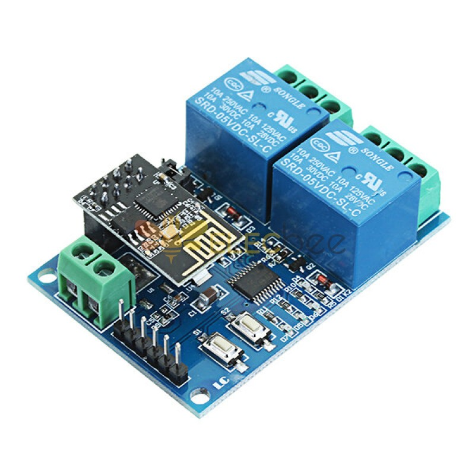
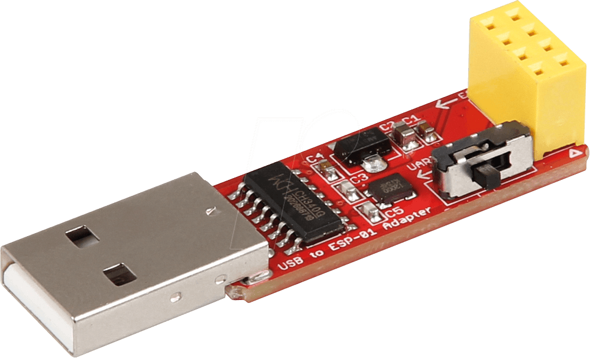

# Arduino code to control an ESP8266 WiFi Relay Module with MQTT

This project can be used to reprogram the cheap ESP8266 WiFi relay modules that are readily available.
Once this firmware is flashed to the ESP8266 microcontroller, you can control the relay(s) through MQTT commands.

The code is short and easy to read, so it should be easy to adapt it to your specific needs.

## The ESP8266 WiFi Relay Module

This code is inteded to work on boards similar to that on the picture.  It consists of the small but powerfull ESP8266 ESP-01 WIFI module that is plugged in to a 8 pin slot.  This ESP-01 is communicating with another microcontroller on the main board itself (STC15F104ESW or similar).  It is this microcontroller that is controlling the relay blocks.



The ESP01 controls the main board microcontroller through a simple serial communication protocol.

```
+------------+                 +-------------------+              +---------+
|   ESP-01   |  -- Serial -->  |   main board MCU  |  -- I/O -->  |  relay  |   
+------------+                 +-------------------+              +---------+
```

### The Serial protocol

The ESP-01 must send serial commands to the main board MCU to control the relay switches.  The protocol messages are as follows:

| Relay # | ON/OFF | Serial command     |
| ----    | ----   | ----------------   |
| #1      | ON     | `A00101A2`         |
| #1      | OFF    | `A00100A1`         |
| #2      | ON     | `A00201A3`         |
| #2      | OFF    | `A00200A2`         |
| #3      | ON     | `A00301A4`         |
| #3      | OFF    | `A00300A3`         |
| #4      | ON     | `A00401A5`         |
| #4      | OFF    | `A00400A4`         |


## Programming the ESP8266 ESP-01

The easiest way to program the ESP01 is by using a USB to UART board for the ESP-01.

To boot the ESP-01 in programming mode, the GPIO0 pin must be pulled low.  The easiest way to do this is to buy a USB programmer that has a small switch included. This allows to use the USB programmer in 2 modes: (1) for flashing firmware with the switch closed, and (2) as a serial monitor with the switch open.



If you have one without the switch, you will have to solder some wires to the correct pins on the USB programmer (GND and GPIO0) to make it possible to connect them. You can find ample instructions for this on the Internet.

## Building and flashing this project

This project was developed using the PlatformIO (https://platformio.org/) plugin for Visual Studio Code.

PlatformIO will download the required libraries and build the project for you.

If you prefer to use the Arduino IDE, then it should be easy to copy the C++ code.  The libraries can be added through the Arduino IDE library manager (https://docs.arduino.cc/software/ide-v1/tutorials/installing-libraries/).

[!IMPORTANT]  
You will have to copy the `secrets_template.h` to `secrets.h` and fill in the constants with the correct values for your network.  

## Using the firmware

After flashing the compiled project to the ESP-01, you can control the relays with MQTT messages. 

When the module boots, it will connect to your MQTT server and publish 2 messages:

| Topic | Message                              |
| ----- | -------                              |
| relay/status/ID |                            |


## Trouble shooting

The main board MCU must be in the correct mode to accept commands from the ESP01.  This mode is indicated with the red led on and the green led blinking slowly.  If you see a blue led lit up, you can reset the main board by powering off the unit, holding down button S1 and power up while holding down S1.


